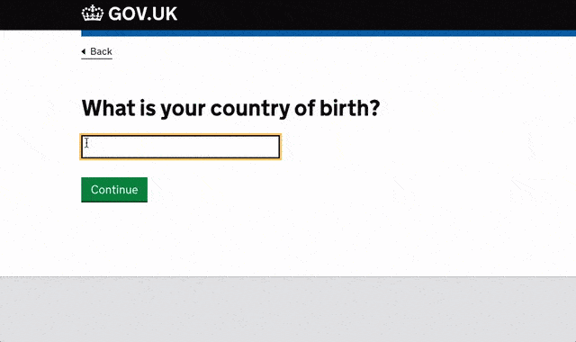

# GOV.UK country and territory autocomplete - what it is and how to use it

---

**This component is not currently maintained and we are unable to respond to issues and pull requests.**

You can still raise issues or pull requests if you want to. As soon as we’re able to, we’ll prioritise dealing with security updates and any bugs that have been raised by people in the UK public sector. We cannot prioritise adding new features.

---

The GOV.UK country and territory autocomplete  is a simple UI widget that allows end users to find and select a location. It includes auto-complete functionality to make it faster and easier for users to find a location. For example, to select their country of birth or their current location.

The autocomplete uses data from the UK government's country and territory registers. To configure the data used in the autocomplete to suit the specific needs of your product or service, please [raise an issue](https://github.com/alphagov/govuk-country-and-territory-autocomplete/issues/new).

The autocomplete itself follows the common look and feel of GOV.UK in line with the [design principles](https://www.gov.uk/design-principles).



This guide will show you how to:
* populate the autocomplete field
* use the autocomplete's data file

[Try out the example.](https://alphagov.github.io/govuk-country-and-territory-autocomplete/examples/)

## Integration process

To integrate an application with the autocomplete, you'll need to:
* use the data from the country and territory registers
* create an accessible autocomplete widget
* keep the data up to date

### Add location data from country and territory registers

To use register data in the autocomplete, you will need two files:
* [location-autocomplete-canonical-list.json](dist/location-autocomplete-canonical-list.json) - a list of every canonical country and territory
* [location-autocomplete-graph.json](dist/location-autocomplete-graph.json) - a directed acyclic graph mapping canonical locations to abbreviations, synonyms, endonyms, and typos

The `location-autocomplete-graph.json` file only contains examples of synonyms, abbreviations, endonyms and typos you might want to consider. It is not a comprehensive list. You may wish to add or remove items based on your own user research.

Copy both files to your application. The `location-autocomplete-graph.json` file must be exposed as a public asset.

You can also install the location autocomplete using `npm`:

```bash
$ npm install govuk-country-and-territory-autocomplete
$ ls node_modules/govuk-country-and-territory-autocomplete/dist/
location-autocomplete-canonical-list.json
location-autocomplete-graph.json
location-autocomplete.min.css
location-autocomplete.min.js
location-autocomplete.min.js.map
```

The `location-autocomplete-canonical-list.json` file contains an array of arrays containing the location names and ISO codes:

```js
> JSON.parse(fs.readFileSync('data/location-autocomplete-canonical-list.json', 'utf8'))
[["Abu Dhabi", "territory:AE-AZ"], ["Afghanistan", "country:AF"], …]
```

You should parse this file on your application's server or as part of the build process to produce a plain HTML `<select>` dropdown. This is your progressive enhancement fallback. You should render something that looks like this:

```html
<select id="location-autocomplete">
  <option value="territory:AE-AZ">Abu Dhabi</option>
  <option value="country:AF">Afghanistan</option>
  …
</select>
```

### Create an accessible autocomplete widget

To make it easier for users to find a location using the autocomplete, you should progressively enhance the front-end to add auto-complete functionality. As a user types, the autocomplete will suggest a list of possible locations for the user to choose from.

On the page where you're rendering the previous `<select>` dropdown, include the following HTML, updating the `/assets/` URLs as needed for your application:

```html
<!-- In your <head> -->
<link rel="stylesheet" href="/assets/location-autocomplete.min.css" />

<!-- At the end of your <body> -->
<script type="text/javascript" src="/assets/location-autocomplete.min.js"></script>
<script type="text/javascript">
  openregisterLocationPicker({
    selectElement: document.getElementById('location-autocomplete'),
    url: '/assets/location-autocomplete-graph.json'
  })
</script>
```

This will render the same `<select>` menu as before on the server, but hides it and progressively enhances to a autocomplete when JavaScript kicks in. When the user selects something in the autocomplete, the hidden `<select>` menu is still updated, so everything works as before.

[If you prefer to learn by reading the source, try out the example.](https://alphagov.github.io/govuk-country-and-territory-autocomplete/examples/)

### Adding additional entries and synonyms

You can pass in custom entries and synonyms using the [`additionalEntries` and `additionalSynonyms` option](https://github.com/alphagov/openregister-picker-engine#optionsadditionalentries):

```html
<script type="text/javascript">
  openregisterLocationPicker({
    additionalEntries: [
      { name: 'Atlantis', code: 'country:AN' }
    ],
    additionalSynonyms: [
      { name: 'Albion', code: 'country:GB' }
    ],
    selectElement: document.getElementById('location-autocomplete'),
    url: '/assets/location-autocomplete-graph.json'
  })
</script>
```

You can additionally specify custom synonyms on the `<option>` elements by using the `data-additional-synonyms` attribute:

```html
<select id="location-autocomplete">
  <option value="territory:GB" data-additional-synonyms='["Blighty"]'>United Kingdom</option>
  <option value="country:RO" data-additional-synonyms='["Dacia"]'>Romania</option>
</select>
```

## Keep the data up to date

Government Digital Service will publish new versions of the `govuk-country-and-territory-autocomplete` package when the data changes, such as when countries are renamed.

To keep up to date, you can use dependency monitoring tools, such as:

- [Greenkeeper](https://greenkeeper.io/), a GitHub bot that will submit pull requests to your open source project when there are new versions of your dependencies
- [David](https://www.npmjs.com/package/david), a command line tool that can be configured to run on your continuous integration environment and return a non-zero status when there are new versions of your dependencies

## Glossary

country register - A list of British English-language names and descriptive terms for countries.

location - A country or territory.

autocomplete - A widget that allows you to choose from items in a register.

register - A list of information designed to be an accurate and up-to-date source of data from government. Once entered into a register, the contents can only be added to, they cannot be deleted or rewritten.

territory - An administrative or geographical entity that isn't recognised as a country by the UK.

territory register - A list of British English-language names and descriptive terms for political, administrative and geographical entities that aren’t recognised as countries by the UK.

## Releasing

* Update CHANGELOG
* Update package.json
* `npm version`
* Merge to `main`
* Create GitHub release tag
* `npm publish`
